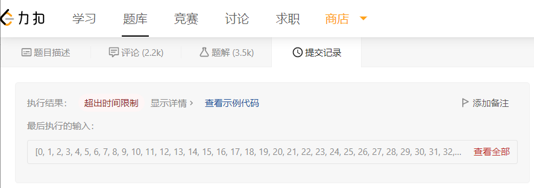
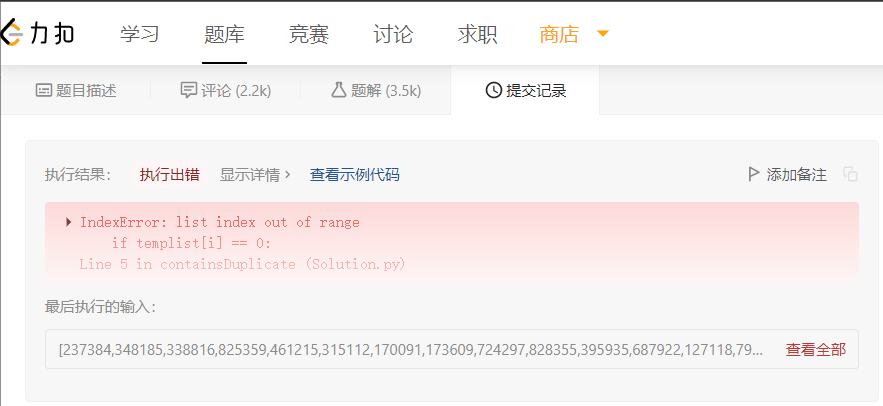
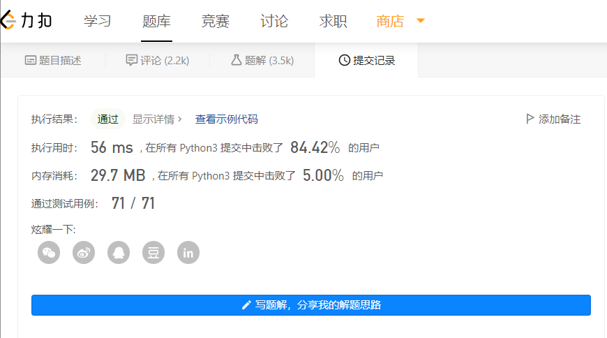
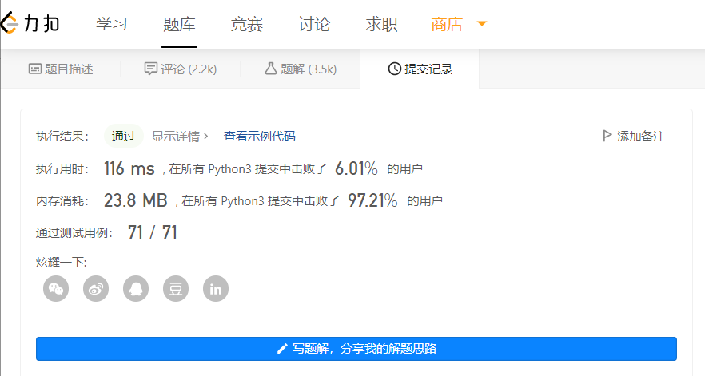

# Question: Contains Duplicate 
#### Level: easy<br>
<br>


## Question Description

Given an integer array `nums`,<br>
return `true` if any value appears at least twice in the array, <br>
and return `false` if every element is distinct.<br>

## Example
```
Input: nums = [1,2,3,1]
Output: true
```
```
Input: nums = [1,2,3,4]
Output: false
```
```
Input: nums = [1,1,1,3,3,4,3,2,4,2]
Output: true
```
## Constraints

* 1 <= `nums.length` <= 10^5
* -10^9 <= `nums[i]` <= 10^9

## 解决思路
### 初始想法
Python中建立一个临时空列表temp，遍历数组元素，如果该元素in在temp中则返回true，否则将该元素加入temp继续遍历，直到遍历完整个列表返回false。该时间复杂度为in关键字的时间复杂度×N。

### 进一步想法
建立大型数组用数组下标标记元素。初始化一个长度为2x10^9的数组。遍历nums，将元素作为下标更改大型数组的值。当遇到数组的值与原来不相同时返回false。空间复杂度过高无法实现。

### 哈希表法
在进一步想法的基础上，缩减空间复杂度，将大型数组改为哈希表存储元素。在Python中字典即用了哈希表结构，因此使用字典来存储。

### 排序法
先对nums进行排序，之后通过比较相邻元素是否相等来判断是否重复。时间复杂度较高，空间复杂度较低。


## 代码(Python)
```Python
初始想法

class Solution:
    def containsDuplicate(self, nums: List[int]) -> bool:
        templist = []
        for i in nums:
            if i not in templist:
                templist.append(i)
            else:
                return True
        return False
```

```Python
进一步想法（示例）

class Solution:
    def containsDuplicate(self, nums: List[int]) -> bool:
        templist = [0]*100  #实际操作中该值为2x10^9
        for i in nums:      #实际操作中需要考虑负值转化
            if templist[i] == 0:
                templist[i] = 1
            else:
                return True
        return False
```
```Python
哈希表法

class Solution:
    def containsDuplicate(self, nums: List[int]) -> bool:
        tempdict = {}
        for i in nums:      
            if i in tempdict:
                return True
            else:
                tempdict[i] = 1
        return False
```
```Python
排序法
class Solution:
    def containsDuplicate(self, nums: List[int]) -> bool:
        nums = sort(nums)
        for i in range(len(nums)):      
            if nums[i] == nums[i+1]:
                return True
        return False


```


## 提交记录
初始想法
<br>


<br>

进一步想法
<br>


<br>

哈希表法
<br>


<br>

排序法
<br>

<br>