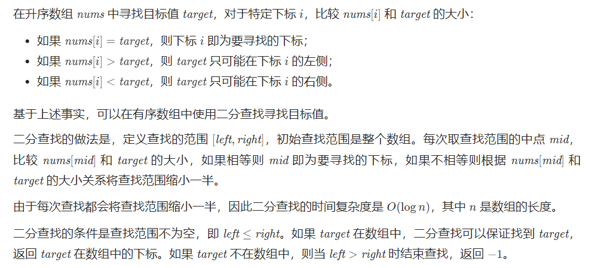

# Question: Binary Search
#### Level: easy
<br>

## Question Description
Given an array of integers `nums` which is sorted in ascending order, and an integer `target`, write a function to search `target` in `nums`. If `target` exists, then return its `index`. Otherwise, return `-1`.

You must write an algorithm with `O(log n)` runtime complexity.
## Example
```
Example 1:

Input: nums = [-1,0,3,5,9,12], target = 9
Output: 4
Explanation: 9 exists in nums and its index is 4
```
```
Example 2:

Input: nums = [-1,0,3,5,9,12], target = 2
Output: -1
Explanation: 2 does not exist in nums so return -1
```


## Constraints
* 1 <= `nums.length` <= 104
* -10^4 < `nums[i]`, `target` < 10^4
* All the integers in `nums` are unique.
* `nums` is sorted in ascending order.

## 解决思路
普普通通二分查找。
<br>

<br>

## 代码(Python)
```Python
循环法（执行用时36ms，内存消耗15.9MB）
class Solution:
    def search(self, nums: List[int], target: int) -> int:
        left, right = 0, len(nums) - 1
        while left <= right:
            mid = (right - left) // 2 + left
            num = nums[mid]
            if num == target:
                return mid
            elif num > target:
                right = mid - 1
            else:
                left = mid + 1
        return -1
```
```Python
迭代法（执行用时44ms，内存消耗15.9MB）【此处为保持函数格式加入一个内函数】
class Solution:
    def search(self, nums: List[int], target: int) -> int:
        left, right = 0, len(nums) - 1
        def binary_search(nums, left, right, target):
            if left > right: 
                return -1
            mid = (left + right) // 2
            if target < nums[mid]:
                right = mid -1
            elif target > nums[mid]:
                left = mid + 1
            else:
                return mid
            return binary_search(nums, left, right, target)
        return binary_search(nums, left, right, target)
```